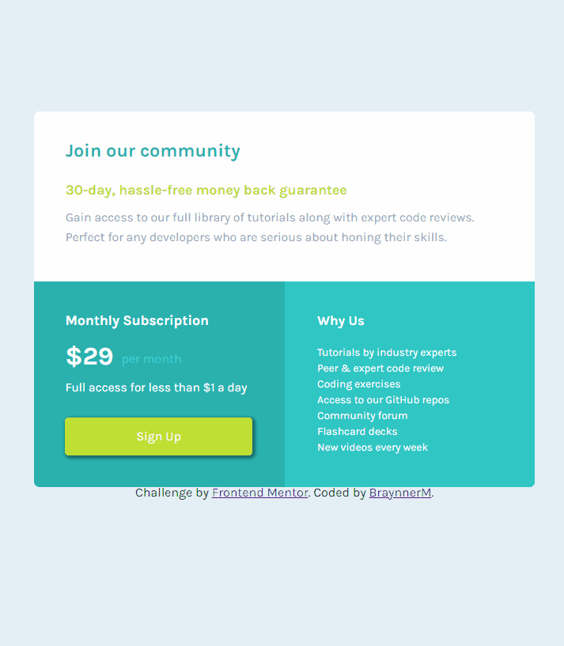

# Frontend Mentor - 3 Column preview card component main challenge

Esta é uma solução para o desafio do Frontend Mentor [Single price grid component master challenge on Frontend Mentor](https://www.frontendmentor.io/challenges/single-price-grid-component-5ce41129d0ff452fec5abbbc/hub). Os desafios do Frontend Mentor ajudam a melhorar minhas habilidades de codificação criando projetos realistas.

## Índice

- [Visão geral](#visão-geral)
  - [O desafio](#o-desafio)
  - [Captura de tela](#captura-de-tela)
  - [Links](#links)
- [Meu processo](#meu-processo)
  - [Construído com](#construído-com)   
  - [Recursos úteis](#recursos-úteis)
- [Autor](#autor)
- [Agradecimentos](#agradecimentos)

## Visão geral

### O desafio

Os usuários devem ser capazes de:

- Visualizar o layout ideal dependendo do tamanho da tela do dispositivo

### Captura de tela

### Links

- URL da solução: [Github](https://github.com/BraynnerM/single-price-grid-component-master)
- URL do site no Github Pages: [Single price grid component master](https://single-price-grid-component-master-alpha-nine.vercel.app/)

## Meu processo

### Construído com

- Marcação semântica HTML5 
- Propriedades personalizadas do CSS
- Display grid
- Flexbox
- Sass
- React

### Recursos úteis

- [Perfect pixel](https://www.welldonecode.com/perfectpixel/) - Me ajudou muito a conseguir fazer o meu projeto a ficar o mais parecido possível com o modelo do Frontend mentor.
- [Responsive viewer](https://responsiveviewer.org/) - Me ajudou a visualizar a responsividade do projeto para diferentes tamanhos de tela.

## Autor

- Linkedin - [BraynnerM](https://www.linkedin.com/in/braynner-marques-ribeiro-de-oliveira-88142b256/)
- Github - [BraynnerM](https://github.com/BraynnerM)
- Frontend Mentor - [BraynnerM](https://www.frontendmentor.io/profile/BraynnerM)
- Twitter - [BraynnerMarques](https://twitter.com/BraynnerMarques)
- E-mail - [braynnermarques@hotmail.com](mailto:braynnermarques@hotmail.com)

## Agradecimentos

Agradeço aos [Gêmeos - Dev em dobro](https://www.instagram.com/devemdobro/) que contribuiram muito com ensinamentos para que a resolução deste projeto fosse possível.
